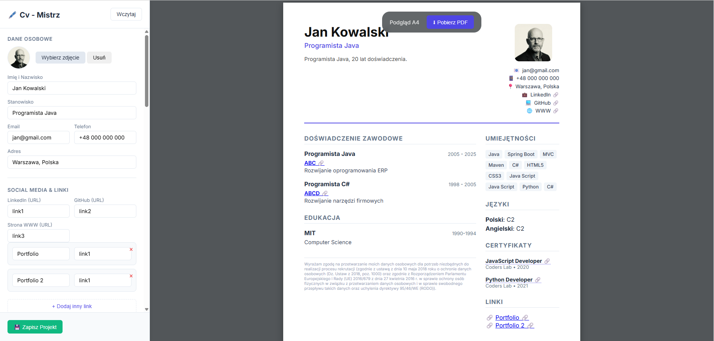

# 📄 Cv-Mistrz


**Cv - Mistrz** to nowoczesna, w pełni darmowa aplikacja typu SPA (Single Page Application) do tworzenia profesjonalnych dokumentów CV bezpośrednio w przeglądarce. Aplikacja stawia na prywatność – wszystkie dane przetwarzane są lokalnie (Client-side), bez wysyłania ich na serwer.



# 🚀 Główne Funkcjonalności

* **Edycja w czasie rzeczywistym (Live Preview):** Podział ekranu na edytor i podgląd. Wszelkie zmiany w formularzu są natychmiast widoczne na wizualizacji dokumentu A4.
* **Prywatność danych:** Brak backendu. Twoje dane osobowe i zdjęcia nigdy nie opuszczają Twojego urządzenia.
* **Dynamiczne sekcje:** Możliwość dodawania dowolnej liczby pozycji w sekcjach: Doświadczenie, Edukacja, Certyfikaty, Języki oraz Linki.
* **Inteligentny eksport PDF:** Generowanie plików PDF z zachowaniem **klikalnych linków** (LinkedIn, GitHub, Portfolio) mimo renderowania dokumentu jako grafiki.
* **Zapis i Odczyt Projektu:** Możliwość zapisania stanu pracy do pliku `.json` i wznowienia edycji w dowolnym momencie.
* **Automatyczne RODO:** Aplikacja startuje z domyślnie wpisaną, aktualną klauzulą o ochronie danych osobowych.
* **Obsługa zdjęć:** Przetwarzanie zdjęć do formatu Base64 (zaszytych w pliku projektu).

## 🛠️ Technologie i Biblioteki

Projekt został napisany w czystym **JavaScript (Vanilla JS)**, **HTML5** oraz **CSS3** (z wykorzystaniem CSS Grid i Flexbox).

Wykorzystane biblioteki zewnętrzne:
* [html2canvas](https://html2canvas.hertzen.com/) - do renderowania drzewa DOM jako obrazu (Canvas).
* [jspdf](https://github.com/parallax/jsPDF) - do generowania pliku PDF z obrazu.
* [SortableJS](https://sortablejs.github.io/Sortable/) - (opcjonalnie) do obsługi list.

## 💾 Struktura Danych (JSON)

Aplikacja wykorzystuje pliki JSON do przenoszenia stanu projektu (`saveCV` / `loadCV`). Struktura pliku wygląda następująco:

```json
{
  "meta": {
    "date": "2023-10-27T10:00:00.000Z"
  },
  "personal": {
    "fullName": "Jan Kowalski",
    "jobTitle": "Frontend Developer",
    "email": "jan@example.com",
    "rodo": "Treść klauzuli..."
  },
  "photo": "data:image/jpeg;base64,/9j/4AAQSkZJr...",
  "experience": [
    {
      "title": "Senior Dev",
      "company": "Tech Corp",
      "link": "[https://techcorp.com](https://techcorp.com)"
    }
  ],
  "skills": "HTML, CSS, JS"
}

```

* **Dane proste:** Stringi dla pól tekstowych.
* **Zdjęcia:** Konwertowane do formatu **Base64**, dzięki czemu są integralną częścią pliku JSON.
* **Tablice obiektów:** Dla sekcji dynamicznych (Doświadczenie, Edukacja itp.), co pozwala na elastyczne odtwarzanie formularza przy wczytywaniu.

## 🎨 Jak działa generowanie PDF i Canvas?

Jednym z największych wyzwań w generatorach CV opartych na przeglądarce jest zachowanie stylów CSS w pliku PDF. Zastosowano tutaj hybrydowe podejście:

1. **Renderowanie (Canvas):** Biblioteka `html2canvas` wykonuje "zrzut ekranu" elementu HTML `#cvContent` i rysuje go na elemencie `<canvas>` w pamięci przeglądarki. Pozwala to zachować idealne odwzorowanie układu, fontów i cieni.
2. **Konwersja:** Zawartość Canvasa jest zamieniana na obraz (JPEG).
3. **Generowanie PDF:** Biblioteka `jspdf` wkleja ten obraz do dokumentu A4.
4. **Mapowanie Linków (Smart Links):** Ponieważ Canvas spłaszcza tekst do obrazka, linki przestają działać. Aplikacja rozwiązuje to algorytmem:
* Skanuje oryginalny HTML w poszukiwaniu tagów `<a>`.
* Pobiera ich współrzędne i wymiary (`getBoundingClientRect`).
* Przelicza piksele ekranowe na milimetry w dokumencie PDF.
* Nakłada na plik PDF "niewidzialne strefy klikalne" (`pdf.link()`) dokładnie tam, gdzie znajdują się linki wizualne.


## 📥 Instalacja i Uruchomienie

Ponieważ jest to aplikacja typu Client-side, nie wymaga instalacji Node.js ani konfiguracji serwera.

1. Sklonuj repozytorium:
```bash
git clone [https://github.com/Programista-Art/Cv-Mistrz.git]

```


2. Otwórz plik `index.html` w dowolnej nowoczesnej przeglądarce (Chrome, Firefox, Edge).

## 📄 Licencja

Projekt udostępniony na licencji MIT. Możesz go dowolnie modyfikować i używać do celów prywatnych oraz komercyjnych.

```

```